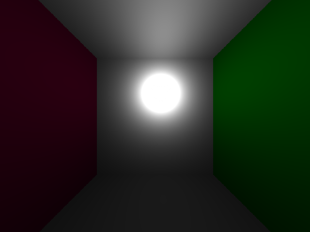

# small-raytracer

A very small and very incapable raytracer in C.

Contains a hard coded scene (Cornell box without spheres) and outputs to a file called "[test.bmp](test.bmp "small-raytracer/test.bmp at master · eltikia/small-raytracer")".

Just run make and then ./raytracer. Tested on OSX, OpenBSD, Linux and Cygwin.

## ./raytracer

